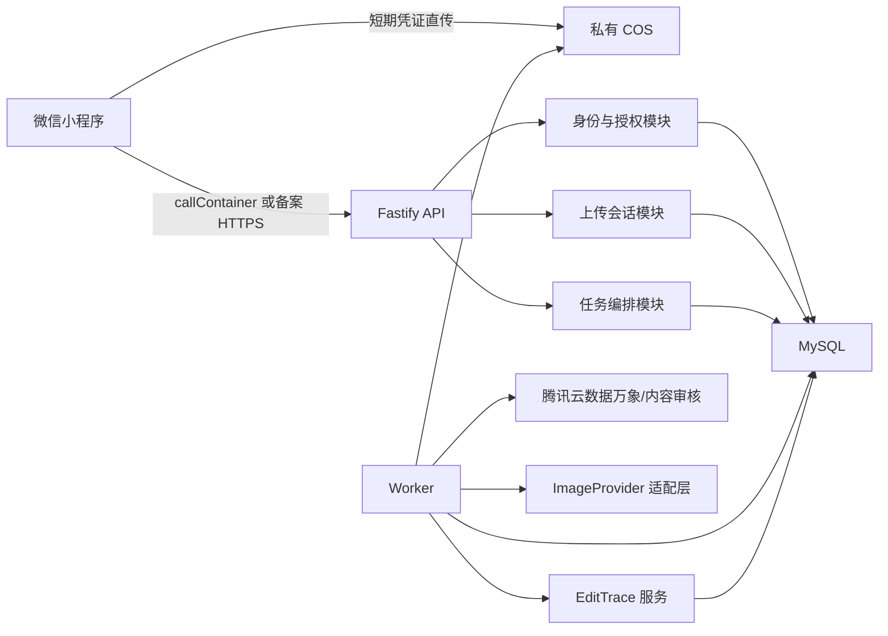

# Project-002 阶段 B 架构与合规就绪设计

> 版本：v01
> 日期：2026-08-02
> 分支：`codex/v1-phase-b-readiness-design`
> 状态：设计规格已完成自查，等待用户书面审阅
> 实施状态：未开始；本文不授权编写阶段 B 业务代码或创建计费资源

## 1. 决策摘要

阶段 B 采用用户确认的“方案 A 国内部署修订版”：

- 保持现有 TypeScript、Node.js、Fastify、Zod 和 npm workspaces 技术方向。
- 采用模块化单体代码库，提供 `API` 与 `Worker` 两个独立运行入口。
- API 只受理、校验和查询请求；Worker 执行规范化、审核、供应商任务、质量检查和删除作业。
- 腾讯/微信国内云生态承担运行、存储、数据库和审核；线上运行不依赖境外 SaaS。
- MySQL 同时保存业务状态、连续事件和首版租约作业队列；不预置 Redis、Kafka 或其他消息队列。
- COS 全私有，使用短时最小权限凭证；小程序不得接触永久密钥、AppSecret 或供应商密钥。
- 微信云托管可信调用链路优先；若账号、地域或产品能力不满足，则使用腾讯云云托管加已备案 HTTPS 域名。
- 图像供应商未确定不阻塞 B0、B1、B2，但阻塞 B3 真实接入、质量/成本/时延验收和发布判断。

该决策只冻结设计基础，不表示产品可发布。

## 2. 范围与阶段拆分

阶段 B 继续拆成独立可验收单元：

1. **B0：架构与合规就绪**——冻结本规格，不创建云资源。
2. **B1：微信身份与授权**——正式 AppID、登录、会话、设备、授权和注销。
3. **B2：上传会话、COS 和内容审核**——真实图片直传、规范化、审核、异常处理和删除。
4. **B3：供应商适配与主备路由**——取得真实供应商和测试权限后接入。
5. **B4：质量检查、失败恢复、删除与数据保留**——故障注入、恢复和删除演练。

每个实施单元必须使用新的 `codex/*` 分支和独立 worktree。B0 设计分支不得混入 B1–B4 业务实现。

本阶段不包含支付、积分账本、广告、审美档案、审美共创、创意生成或生产发布。

## 3. 已确认输入边界

### 3.1 国内部署与基础设施

- 首选腾讯云上海地域；CloudBase/微信云托管、COS、MySQL 和内容安全尽量保持同地域或国内低延迟链路。
- 优先使用国内可直连、中文控制台完整、无需网络代理的产品。
- 正式开通前必须在用户账号中核对产品可用性、地域、调用链路和计费，不能仅凭文档假设。
- V1 不预置 CDN、Redis 或消息队列。
- 微信云托管与普通腾讯云 CloudBase/云托管不得在文档和代码中混为同一产品。

### 3.2 图片保存与删除

- 原图：7 天。
- 低清水印预览：7 天。
- 付费结果：30 天。
- 用户主动删除后立即在产品中隐藏并禁止访问。
- 业务索引与 COS 活跃对象在 24 小时内删除。
- 备份最长 30 天自然淘汰，期间不得恢复到线上。
- 平台立即向供应商发起删除；供应商必须提供书面保存与删除期限。

### 3.3 登录、会话与设备

- 首页和工具说明允许匿名浏览；首次上传时才触发隐私确认和微信身份建立。
- V1 不强制获取头像、昵称或手机号。
- 正式 AppID：`wx4f7678cc595d276b`；AppSecret 只通过部署密钥管理注入。
- 访问令牌有效 2 小时；可轮换刷新会话最长 30 天。
- 刷新凭证使用后立即轮换，旧凭证失效。
- 同一账号最多 5 个活跃设备会话；超过时撤销最久未使用的会话。
- 支持退出当前设备、退出全部设备和服务端主动撤销。
- 微信云托管可信身份上下文与应用会话必须同时校验用户一致性，不能只信任客户端声明。

### 3.4 账号注销

- 注销前重新验证微信身份并明确提示不可恢复。
- 确认后立即撤销全部会话、隐藏账号和图片、停止未开始任务。
- 进行中的付费任务必须先完成退款或补偿结算；支付阶段不在本规格实施范围。
- 用户资料、审美档案、任务索引及活跃图片在 24 小时内删除或不可逆匿名化。
- 法律要求保留的支付、退款、财务与安全记录实行最小化和隔离保存，不再用于推荐或营销；具体期限上线前经合规复核。

## 4. 上传与图片规范

### 4.1 允许格式和硬边界

- 接受 `JPEG/JPG`、`PNG`、`HEIC/HEIF`。
- 单个原始上传文件最大 30MB；超限时不静默压缩。
- 短边不得低于 256px。
- 长边不得超过 12,000px。
- 总像素不得超过 50MP。
- 短边低于 1,024px 时允许继续，但必须提示质量风险。
- GIF、WebP、TIFF、BMP、RAW 和动态图片在 V1 不支持。
- PNG 含真实透明区域时不自动铺白或改变画面，提示用户导出为 JPEG 或不透明 PNG。

服务端按文件魔数和实际解码结果判断格式，不信任扩展名、客户端 MIME 或客户端尺寸。

### 4.2 元数据与颜色

- 私有 COS 原始对象在 7 天期限内保持原文件不变。
- 审核、供应商处理和结果输出统一使用规范化副本。
- 规范化副本应用 EXIF 旋转并转换为 sRGB。
- 不向审核服务或图像供应商发送原始 EXIF。
- 删除 GPS、设备信息和内嵌缩略图前必须取得用户显式同意。
- 首次上传隐私页单独说明元数据清理，复选框不得默认勾选；不同意则不上传。
- 授权按版本记录，可在隐私设置撤回；规则实质变化时重新征求同意。

### 4.3 上传会话与凭证

- 上传会话有效 30 分钟。
- COS 临时凭证有效 10 分钟，仅允许写入本用户、本会话的唯一对象路径。
- 凭证过期但会话仍有效时只允许重新签发一次。
- 会话过期后必须重新选择图片，不复用旧对象。
- 未完成、失效或异常对象进入持久化清理作业，不扣免费次数或积分。

### 4.4 异常图片

- 损坏、无法解码、伪装格式、动态图片、解压炸弹、像素或体积超限直接拒绝。
- 规范化只允许一次安全重试；仍失败则关闭上传会话。
- 异常场景不创建修图任务、不扣权益，并删除无效临时对象。

## 5. 内容审核

### 5.1 审核副本

- 审核使用已获元数据清理授权的规范化副本。
- 长边超过 10,000px 时生成最长边不超过 10,000px 的审核专用副本，修图副本仍可保留已确认的 12,000px 上限。
- 大于 5MB 的图片按腾讯云内容审核大图能力配置，不能默认按小图同步接口处理。
- 审核副本不得用于正式交付或替换原始高分辨率处理副本。

### 5.2 结果和人工复核

- 明确通过：继续诊断和方案生成。
- 明确拒绝：终止并清理，不进入供应商链路，不扣权益。
- 疑似违规：自动复核一次；仍无法通过则终止。
- V1 不建立人工查看用户原图的复核队列。
- 用户可提交不附原图的误判反馈；未来有合规团队后再评估人工申诉。

### 5.3 审核服务故障

- 最多尝试 3 次：首次失败后约 30 秒和 2 分钟重试。
- 总等待不超过 5 分钟。
- 重试期间保留私有临时对象；用户可退出，返回后恢复结果。
- 三次均失败则关闭会话、清理临时对象且不扣权益。

### 5.4 用户提示

- 拒绝：显示“图片未通过安全检测，暂时无法处理，请更换图片”。
- 只有审核服务返回稳定且适合面向用户的分类时，才补充宽泛原因。
- 不展示供应商名称、原始标签、置信度或风控规则。
- 疑似内容复核时显示“正在进行安全复核”。
- 服务故障明确说明本次不会扣除次数或积分，并提示稍后重试。

## 6. 总体架构



API 与 Worker 可以从同一镜像或同一代码库构建，但必须是独立入口。HTTP 请求生命周期内不得等待真实供应商完成。

生产入口必须支持平台注入的 `PORT`、监听 `0.0.0.0`、提供健康检查，并使用结构化日志。当前阶段 A 的 `127.0.0.1:3100` 只保留为本地测试配置。

## 7. 组件边界

| 组件 | 职责 | 禁止事项 |
|---|---|---|
| `IdentityService` | 微信身份、应用会话、设备与撤销 | 不读取图片，不管理 COS |
| `ConsentService` | 协议版本、元数据授权与撤回 | 不把未确认建议写成授权 |
| `UploadSessionService` | 会话、凭证、对象路径和归属 | 不直接创建计费任务 |
| `ImageNormalizer` | 格式、旋转、颜色、元数据和审核副本 | 不静默改变构图或铺底色 |
| `ObjectStorage` | 私有对象、短期地址和删除 | 业务层不依赖 COS 原始字段 |
| `ContentModerator` | 审核、复核和统一结果 | 不暴露供应商标签和置信度 |
| `TaskOrchestrator` | 任务状态、供应商受理、质量和恢复 | 不在 HTTP 请求中同步跑供应商 |
| `TaskQueue` | 作业入队、租约、重试和恢复 | 首版实现不得依赖进程内存 |
| `ImageProvider` | 四类工具统一供应商接口 | 小程序不得直接调用供应商 |
| `EditTraceService` | 真实事件转换和连续序号 | 不编造隐藏推理或固定脚本 |
| `DataLifecycleService` | 保留期限、删除和注销 | 删除失败不得静默丢弃 |

外部产品通过接口和适配器接入。`ObjectStorage`、`ContentModerator`、`TaskQueue` 和 `ImageProvider` 必须具备模拟适配器及契约测试。

## 8. 数据模型

首版至少包含以下逻辑表；字段名在实施计划中细化：

| 表 | 关键内容 |
|---|---|
| `users` | 平台用户、状态、注销时间 |
| `identity_bindings` | AppID、OpenID/UnionID（如合法可用）、内部用户映射 |
| `consents` | 授权类型、协议版本、确认时间、撤回时间 |
| `sessions` | 设备会话、刷新凭证摘要、轮换与撤销状态 |
| `upload_sessions` | 用户、状态、过期时间、对象路径、凭证签发次数 |
| `assets` | 原图/规范化/审核/预览/结果对象、归属和删除期限 |
| `moderation_checks` | 审核尝试、统一结果、错误类别和时间 |
| `tasks` | 工具、输入引用、状态、幂等键、失败码 |
| `provider_runs` | 供应商适配器、外部任务号、尝试和删除状态 |
| `task_events` | 任务内连续序号、可见性、复制键和严格载荷 |
| `jobs` | 类型、状态、租约、尝试、下次执行时间和幂等键 |
| `deletion_requests` | 删除范围、截止时间、各系统完成情况和告警状态 |

会话刷新凭证只保存不可逆摘要。对象签名 URL、永久密钥、AppSecret、供应商密钥和完整原始 EXIF 不进入业务表或日志。

## 9. 状态机与一致性

### 9.1 上传会话

```text
INIT → UPLOADING → UPLOADED → NORMALIZING → REVIEWING → APPROVED
                                         └────────────→ REJECTED
任一允许状态 → FAILED / EXPIRED / CANCELED
```

阶段 B 将内容审核从任务状态中分离。当前阶段 A 的 `Task.REVIEWING` 快捷状态不得直接沿用为真实上传审核状态。

### 9.2 修图任务

```text
DIAGNOSING → AWAITING_CONFIRMATION → QUEUED → PROCESSING
PROCESSING → QUALITY_CHECKING → SUCCEEDED
QUALITY_CHECKING → PROCESSING（有限质量重试）
任一允许状态 → FAILED / CANCELED
```

审核通过后才能创建诊断/修图任务。供应商未受理前允许取消；受理后的取消、权益和成本处理由后续支付规格补充。

### 9.3 作业

```text
READY → LEASED → SUCCEEDED
LEASED → RETRY_WAIT → READY
LEASED → FAILED
READY / RETRY_WAIT → CANCELED
```

作业领取必须使用数据库原子条件和租约。Worker 崩溃后，租约过期的作业可以由其他 Worker 重新领取。

### 9.4 事务规则

- 任务状态、作业入队和首个事件必须在同一事务中提交。
- 每个用户确认动作携带幂等键，重复请求返回原结果。
- `task_events` 对 `(task_id, sequence)` 建唯一约束。
- 作业副作用使用幂等键或外部请求号，避免租约恢复造成重复供应商调用或重复删除。
- 只有“成功生成可查看水印预览”后才扣免费次数或预览积分。

## 10. 核心数据流

```text
选择图片
→ 展示隐私与元数据清理授权
→ 建立微信身份和应用会话
→ 创建 30 分钟上传会话
→ 获取 10 分钟最小权限 COS 凭证
→ 直传私有 COS
→ 服务端复核归属、格式、大小和像素
→ 生成规范化副本及审核副本
→ 内容审核
→ 审核通过后诊断并生成推荐方案
→ 用户确认参数和预览权益
→ MySQL 事务创建任务与作业
→ Worker 调用模拟或真实供应商
→ 质量检查和有限重试
→ 生成水印预览与真实 EditTrace
→ 成功展示后扣减对应权益
```

小程序离开页面不终止任务；重新进入后按服务端任务状态和事件序号恢复。

## 11. 错误处理与恢复

| 场景 | 系统动作 | 权益 |
|---|---|---|
| 登录过期 | 静默刷新；失败则重新建立微信会话 | 不扣 |
| COS 凭证过期 | 会话期内重新签发一次 | 不扣 |
| 图片无效 | 拒绝、清理并给出修改建议 | 不扣 |
| 规范化失败 | 安全重试一次后终止 | 不扣 |
| 审核疑似 | 自动复核一次 | 不扣 |
| 审核服务故障 | 三次/五分钟内重试 | 不扣 |
| 审核拒绝 | 清理，不进入供应商 | 不扣 |
| MySQL 故障 | 事务回滚，不返回虚假受理 | 不扣 |
| Worker 中断 | 租约到期后恢复 | 不重复扣 |
| 供应商超时 | 按配置重试或切备 | 同任务不重复扣 |
| 质量不合格 | 同任务有限重试，仍失败则终止 | 恢复权益或退款 |
| 删除失败 | 持续重试并告警，访问立即关闭 | 不影响既有结算 |

重试只针对网络超时、限流和暂时性服务故障。格式错误、权限错误、审核拒绝等永久错误不得重试。

达到重试上限的作业进入运维事件表；运维人员默认看不到用户原图。用户提示必须同时说明失败阶段、权益处理和下一步。

供应商重试次数、主备切换条件和失败是否收费只能在 B3 根据真实合同与测试证据冻结。

## 12. 安全与合规

- 小程序只使用短期业务会话和短期对象权限。
- 服务端同时验证用户、会话、对象路径、文件属性和资源归属。
- 所有用户资源查询必须包含内部用户 ID 条件，不能只凭不可猜 UUID 作为授权。
- 生产环境开启正式域名校验，不沿用阶段 A 的 `urlCheck: false` 验收口径。
- 日志不得记录图片内容、签名 URL、令牌、密钥、OpenID 明文或完整审核标签。
- 腾讯云日志与监控优先，V1 不引入境外 Sentry 等运行时监控服务。
- 默认不使用用户照片训练公共模型；供应商合同和删除条款必须支持该承诺。
- 审美档案、分享、上色和元数据清理分别记录授权，不能用一次总授权替代。

## 13. 国内网络与构建

- 线上运行链路只使用微信、腾讯云和后续通过国内可用性审查的图像供应商。
- API 优先使用微信云托管 `callContainer`；普通 HTTPS 模式必须使用备案域名、有效证书和微信服务器域名白名单。
- COS 直传域名必须加入 `uploadFile`/`request` 对应白名单。
- COS 简单直传优先，避免为单一上传功能引入完整小程序 SDK；若使用 SDK，采用官方小程序 SDK、固定版本并分包。
- 当前锁文件下载地址为 `registry.npmjs.org`。实施时必须提供国内 npm 镜像、固定锁文件和腾讯云构建缓存方案。
- 发布门槛包含在无代理的全新国内环境中完成依赖安装、测试、镜像构建、部署、微信登录、COS 上传和结果访问。
- 本机 Node.js `v24.18.0` 只证明本地阶段 A 环境。生产 Node LTS 镜像必须在选定云平台中核对支持并固定版本。

## 14. 测试与验收

### 14.1 自动化层

- 单元测试：状态机、授权版本、格式/像素、重试分类、保存期限。
- 契约测试：`ObjectStorage`、`ContentModerator`、`TaskQueue`、`ImageProvider`。
- MySQL 集成：事务、并发领取、租约恢复、事件序号、幂等和用户隔离。
- API 安全：未登录、令牌轮换、跨用户访问、伪造路径、重复提交、超限上传。
- 故障注入：API/Worker 在各状态重启，不丢任务、不重复执行、不重复扣费。
- 删除演练：前台隐藏、24 小时活跃数据清理、供应商删除和失败告警。

### 14.2 真实环境层

- JPEG、PNG、HEIC/HEIF；30MB；256px、12,000px、50MP 边界。
- Wi-Fi、移动网络、弱网、中断、凭证过期和重新签发。
- 正式 AppID 下 Android/iOS 真机登录、上传、后台恢复、换机、多端和注销。
- 真实 COS、审核和微信云托管/备案 HTTPS 路径。
- 无代理国内构建与部署。

### 14.3 阶段门槛

- B1 只验收身份、授权和会话。
- B2 真实验证 COS 与审核，不宣称修图质量通过。
- B3 取得真实供应商、测试账号和删除条款后才验收质量、成本和时延。
- B4 通过恢复、删除与数据保留演练。
- 任务成功率不低于 95%、P90 不高于 60 秒仍是发布前目标；真实样本完成前不得宣称达标。

## 15. 监控与运行保障

- 使用腾讯云结构化日志、指标、告警和操作审计。
- 核心指标：上传成功率、审核通过/拒绝/故障率、作业租约超时、供应商成功率、质量重试率、删除逾期数和每张成功结果综合成本。
- 任何删除超过 24 小时、租约反复超时、事件序号冲突或跨用户访问拒绝都必须告警。
- 监控标签不得包含用户图片 URL、OpenID、会话令牌或供应商密钥。

## 16. 未冻结与阻塞项

以下内容仍不得硬编码：

1. 微信云托管与普通腾讯云云托管在用户账号、上海地域和实际费用上的最终部署选择。
2. 生产 Node LTS 镜像版本。
3. 正式域名、ICP 备案和证书方案（仅在不使用纯 `callContainer` 时需要 API 域名）。
4. 腾讯云资源具体规格、预算和告警阈值。
5. 四类工具的真实供应商、主备组合、测试账号和删除条款。
6. 供应商重试、计费和主备切换阈值。
7. 输出规格、商品价格、预览积分和广告上限。
8. 支付、积分、退款和法定财务记录的完整规格。

供应商未定不阻塞 B1/B2，但阻塞 B3 真实接入和任何生产发布判断。

## 17. 规格自查

- **占位符**：正文无 `TBD`、`TODO` 或未替换模板字段；未冻结内容集中列于第 16 节。
- **一致性**：国内托管、上海优先、私有 COS、数据保留、会话、上传和审核规则与用户逐项确认一致。
- **范围**：只设计 B0–B4 架构与合规链路，不引入支付、增长、审美共创或创意模式。
- **歧义**：明确区分微信云托管与普通腾讯云云托管；明确区分上传会话、修图任务和作业状态。
- **现实性**：30MB 小于腾讯云图片处理/审核 32MB 限制；HEIC/HEIF 有腾讯云处理和审核支持；12,000px 原图通过不超过 10,000px 的审核副本解决同步审核边界。
- **阶段门禁**：本文待用户书面审阅；审阅通过后才能编写实施计划，仍不能直接实施业务代码。

## 18. 用户审阅清单

请用户重点确认：

- 方案 A 国内部署修订版是否准确反映最终意图。
- API/Worker 双入口和 MySQL 租约队列是否接受。
- 上传、元数据授权、审核和删除规则是否无遗漏。
- 微信云托管优先、普通腾讯云云托管兜底的表述是否准确。
- 未冻结项是否都应留到对应阶段验证，而不是现在硬编码。

用户书面批准本规格后，下一步仅是调用 `superpowers:writing-plans` 编写阶段 B 分步实施计划；不得跳过计划直接写代码。
